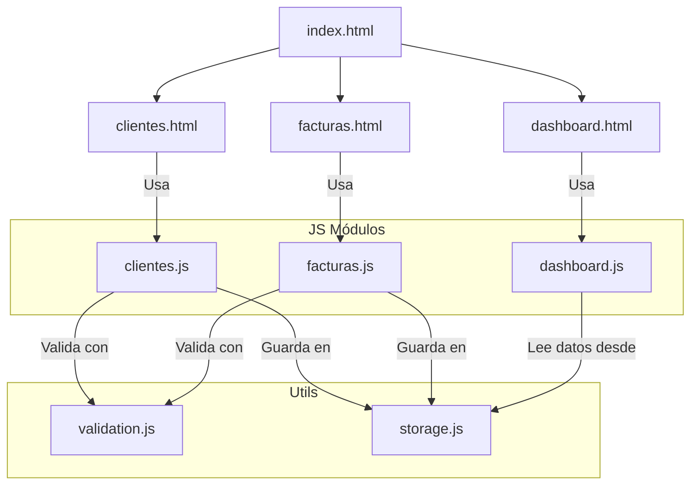

## **Definición de Funcionalidades e Historias de Usuario**

### **Aplicativo Web – Gestión de Clientes y Facturas por Cobrar**

---

## 📋 **Estado de Implementación de Historias de Usuario**

### ✅ **Implementadas**

| Código | Historia | Descripción | Estado |
|:--|:--|:--|:--|
| **HU001** | Registro de cliente | Registrar datos de cliente y contactos | ✅ Completada |

### ⏳ ***Pendientes de Implementar***

| Código | Historia | Descripción | Estado |
|:--|:--|:--|:--|
| **HU002** | Visualización de clientes | Ver lista de clientes registrados | ⏳ Pendiente |
| **HU003** | Mantenimiento de cliente | Editar o eliminar cliente | ⏳ Pendiente |
| **HU004** | Registro de factura por cobrar | Registrar nueva factura | ⏳ Pendiente |
| **HU005** | Gestión de estado de factura | Actualizar estado (Pagada/Cancelada) | ⏳ Pendiente |
| **HU006** | Seguimiento de cobranza | Registrar contactos de cobranza | ⏳ Pendiente |
| **HU007** | Visualización de indicadores | Dashboard con métricas generales | ⏳ Pendiente |
| **HU008** | Alerta de vencimientos | Alertas de facturas próximas a vencer | ⏳ Pendiente |
| **HU009** | Reportes gráficos | Gráficos de estado y evolución | ⏳ Pendiente |

**Total: 1 de 9 historias implementadas (11%)**

---

### **Descripción general

El presente documento define las funcionalidades y las historias de usuario del aplicativo web **“Gestión de Clientes y Facturas por Cobrar”**, cuyo objetivo es facilitar el **registro, control y seguimiento** de las facturas emitidas a crédito por una empresa, así como mantener un historial de los **contactos de cobranza** realizados a cada cliente.

El sistema permitirá realizar la gestión integral de clientes, facturas y seguimientos, además de ofrecer un **panel de control (Dashboard)** que muestre indicadores clave del estado de las cuentas por cobrar.

---

## **1. Página: Creación de Clientes**

### **Funcionalidades**

- Registrar un cliente con los siguientes datos:
    
    - **RUC o DNI** (obligatorio y único)
        
    - **Razón social o representante**
        
    - **Dirección**
        
- Registrar hasta **dos contactos por cliente**, incluyendo:
    
    - Nombre
        
    - Celular
        
    - Email
        
- Validar campos obligatorios antes de guardar.
    
- Guardar la información del cliente y sus contactos en la base de datos.
    

### **Historia de Usuario**

- **HU001 – Registro de cliente**  
    _Como administrador del sistema, quiero registrar los datos de un nuevo cliente y sus contactos, para poder utilizarlos en el registro y seguimiento de facturas por cobrar._
    

---

## **2. Página: Gestión de Clientes**

### **Funcionalidades**

- Visualizar la lista de clientes registrados con:
    
    - RUC/DNI
        
    - Razón social
        
    - Dirección
        
    - Contactos asociados
        
- Editar los datos del cliente y sus contactos.
    
- Eliminar un cliente con confirmación previa.
    
- Validar que **no se pueda eliminar un cliente** si tiene facturas registradas.
    
- Búsqueda simple por RUC/DNI o razón social.
    

### **Historias de Usuario**

- **HU002 – Visualización de clientes**  
    _Como usuario del sistema, quiero visualizar la lista de clientes registrados, para consultar rápidamente su información._
    
- **HU003 – Mantenimiento de cliente**  
    _Como administrador, quiero editar o eliminar un cliente, para mantener actualizada y depurada la información del sistema._
    

---

## **3. Página: Registro y Seguimiento de Facturas por Cobrar**

### **Funcionalidades**

- Registrar una factura por cobrar con los siguientes datos:
    
    - Cliente (selección desde clientes registrados)
        
    - RUC (asociado automáticamente al cliente)
        
    - Número de factura
        
    - Monto
        
    - Fecha de emisión
        
    - Fecha de vencimiento
        
- Validar que el cliente exista antes de registrar la factura.
    
- Al registrar una factura:
    
    - Se asigna automáticamente la fecha de creación.
        
    - El saldo inicial es igual al monto.
        
    - El estado inicial es **Pendiente**.
        
- Visualizar una tabla de facturas con:
    
    - Fecha de creación
        
    - Cliente
        
    - RUC
        
    - Número de factura
        
    - Monto
        
    - Fecha de emisión
        
    - Fecha de vencimiento
        
    - Saldo
        
    - Estado (Pendiente, Pagada, Cancelada)
        
    - Último contacto
        
    - Medio de contacto
        
- Permitir las siguientes acciones:
    
    - Registrar pago (**estado: Pagada**, saldo = 0).
        
    - Cancelar factura (**estado: Cancelada**).
        
### **Historias de Usuario**

- **HU004 – Registro de factura por cobrar**  
    _Como usuario del sistema, quiero registrar una factura por cobrar asociada a un cliente, para llevar el control de las cuentas pendientes._
    
- **HU005 – Gestión de estado de factura**  
    _Como administrador, quiero registrar el pago o cancelar una factura, para mantener actualizado el saldo y el estado de la cuenta por cobrar._
    

---

## **4. Seguimiento de Cobranza por Factura (Valor agregado)**

### **Funcionalidades**

- Registrar el **seguimiento de cobranza** asociado a una factura.
    
- Cada registro de seguimiento incluirá:
    
    - Fecha de contacto
        
    - Medio de comunicación (Llamada, Email, WhatsApp o Presencial)
        
    - Comentario u observación sobre la gestión realizada
        
- Visualizar el historial completo de seguimientos por factura.
    
- Mostrar en la tabla principal de facturas:
    
    - Fecha del último contacto
        
    - Medio del último contacto registrado
        
- El seguimiento solo aplica a facturas con estado **Pendiente**.
    

### **Historia de Usuario**

- **HU006 – Seguimiento de cobranza**  
    _Como usuario de cobranzas, quiero registrar los contactos realizados a una factura, indicando el medio y un comentario, para llevar un control del proceso de cobranza y facilitar el seguimiento._
    

---

## **5. Página: Dashboard (Panel de Control General)**

### **Funcionalidades**

- Mostrar indicadores generales del sistema:
    
    - Total de clientes registrados
        
    - Total de facturas registradas
        
    - Facturas **pendientes**, **pagadas** y **canceladas**
        
    - Monto total **pendiente de cobro**
        
    - Monto total **cobrado**
        
- Visualizar gráficos dinámicos:
    
    - Gráfico de barras o pastel con el estado de las facturas.
        
    - Gráfico de líneas o barras con los montos cobrados por mes.
        
- Mostrar alertas automáticas:
    
    - Facturas **próximas a vencer** (por ejemplo, a 3 días del vencimiento).
        
    - Facturas **vencidas**, resaltadas con color de advertencia.
        
- Incluir accesos directos a las secciones principales:
    
    - Registrar cliente
        
    - Registrar factura
        
    - Ver listado de facturas
        
- Permitir filtrado por rango de fechas (para reportes o gráficos).
    
- Diseño **responsive** adaptable a dispositivos móviles.
    

### **Historias de Usuario**

- **HU007 – Visualización de indicadores generales**  
    _Como administrador, quiero visualizar en un panel los indicadores principales de clientes y facturas, para obtener una visión general del estado de las cuentas por cobrar._
    
- **HU008 – Alerta de vencimientos próximos**  
    _Como usuario del sistema, quiero recibir alertas sobre facturas próximas a vencer o vencidas, para priorizar las gestiones de cobranza._
    
- **HU009 – Reportes gráficos**  
    _Como administrador, quiero visualizar gráficos con el estado y evolución de las facturas, para analizar el comportamiento de la cobranza a lo largo del tiempo._
    

---

## **6. Estructura general del proyecto**

|Nº|Página / Módulo|Descripción breve|Historias de Usuario Asociadas|
|---|---|---|---|
|1|Creación de Clientes|Registro de nuevos clientes y contactos asociados|HU001|
|2|Gestión de Clientes|Edición, eliminación y consulta de clientes|HU002, HU003|
|3|Registro de Facturas|Registro de facturas por cobrar asociadas a clientes|HU004, HU005|
|4|Seguimiento de Cobranza|Registro de contactos y observaciones por factura|HU006|
|5|Dashboard|Panel con indicadores, alertas y reportes gráficos|HU007, HU008, HU009|

---

## **Conclusión**

El aplicativo **Gestión de Clientes y Facturas por Cobrar** permitirá a la empresa llevar un control organizado y eficiente de sus cuentas pendientes, consolidando en una sola herramienta la información de clientes, facturas, pagos y gestiones de cobranza.  
El desarrollo de este sistema promueve el uso de **tecnologías web modernas**, **buenas prácticas de programación** y **metodologías ágiles**, fortaleciendo las competencias del estudiante en el ámbito del desarrollo web profesional.

---

## 🧱 **Estructura Simplificada del Proyecto**

El sistema está diseñado con **3 páginas principales** (Clientes, Facturas y Dashboard), que implementan las **5 secciones funcionales** definidas en el documento de requerimientos.

```text
facturas-por-cobrar/
│
├── index.html                ← Inicio / menú principal
├── clientes.html             ← Creación y gestión de clientes (1 y 2)
├── facturas.html             ← Registro y seguimiento de facturas (3 y 4)
├── dashboard.html            ← Panel principal (5)
│
├── js/
│   ├── main.js
│   ├── clientes.js
│   ├── facturas.js
│   └── dashboard.js
│
├── utils/
│   ├── storage.js
│   └── validation.js
│
├── assets/
│   └── logo.png
│
└── README.md
```

---

## 💡 **Relación entre secciones y páginas HTML**

|Nº|Sección funcional|Página donde se implementa|Descripción breve|
|:--|:--|:--|:--|
|1️⃣|Creación de Clientes|`clientes.html`|Formulario para registrar nuevos clientes y sus contactos.|
|2️⃣|Gestión de Clientes|`clientes.html`|Listado de clientes, edición, eliminación y búsqueda.|
|3️⃣|Registro de Facturas|`facturas.html`|Registro de nuevas facturas asociadas a clientes.|
|4️⃣|Seguimiento de Cobranza|`facturas.html`|Registro y visualización de contactos de cobranza por factura.|
|5️⃣|Dashboard (Panel de control)|`dashboard.html`|Visualización de indicadores, alertas y reportes gráficos.|

---

## 🏠 **1. index.html – Página Principal / Menú General**

### **Rol**

- Punto de entrada del sistema.
    
- Contiene la **barra lateral**, el **encabezado superior** y los **enlaces de navegación** hacia Clientes, Facturas y Dashboard.
    

### **Elementos**

- Logo (`assets/logo.png`)
    
- Enlaces:
    
    - Clientes → `clientes.html`
        
    - Facturas → `facturas.html`
        
    - Dashboard → `dashboard.html`
        

### **Historias de Usuario relacionadas**

- No implementa historias funcionales directas.  
    👉 Sirve como **nodo de navegación** para las HU001–HU009.
    

---

## 👥 **2. clientes.html – Creación y Gestión de Clientes**

### **Funcionalidades**

#### 🧾 Sección A: Registro de Cliente

- Formulario con los campos:  
    **RUC/DNI**, **Razón Social o Representante**, **Dirección**, **Contactos** (nombre, celular, email).
    
- Validación de campos requeridos.
    
- Almacenamiento mediante `storage.js`.
    

#### 📋 Sección B: Gestión de Clientes

- Tabla con lista de clientes.
    
- Acciones: **Editar**, **Eliminar** (solo si no tiene facturas).
    
- Búsqueda por RUC/DNI o Razón Social.
    

### **Historias de Usuario Implementadas**

|Código|Descripción|
|:--|:--|
|**HU001**|Registrar cliente y contactos.|
|**HU002**|Visualizar lista de clientes.|
|**HU003**|Editar o eliminar cliente.|

### **Archivos Relacionados**

- `clientes.html` → interfaz del módulo.
    
- `js/clientes.js` → lógica CRUD.
    
- `utils/storage.js` → operaciones de guardado/lectura.
    
- `utils/validation.js` → validaciones de formularios.
    

---

## 📄 **3. facturas.html – Registro y Seguimiento de Facturas**

### **Funcionalidades**

#### 🧾 Sección A: Registro de Factura

- Formulario con los campos:  
    **Cliente**, **RUC**, **N° de factura**, **Monto**, **Fechas de emisión y vencimiento**.
    
- Validación del cliente antes del registro.
    
- Estado inicial: _Pendiente_ (saldo = monto total).
    

#### 📋 Sección B: Gestión de Facturas

- Tabla general con columnas:  
    Cliente | RUC | N° Factura | Monto | Fechas | Saldo | Estado | Último contacto.
    
- Acciones:
    
    - **Registrar pago** → estado _Pagada_, saldo = 0.
        
    - **Cancelar factura** → estado _Cancelada_.
        
- Filtros por estado (pendiente/pagada/cancelada).
    

#### 💬 Sección C: Seguimiento de Cobranza

- Registro de contactos de cobranza:  
    Fecha, Medio (Llamada, Email, WhatsApp, Presencial), Comentario.
    
- Muestra historial por factura (solo facturas _Pendientes_).
    

### **Historias de Usuario Implementadas**

|Código|Descripción|
|:--|:--|
|**HU004**|Registrar factura por cobrar.|
|**HU005**|Actualizar estado (Pagada/Cancelada).|
|**HU006**|Registrar seguimiento de cobranza.|

### **Archivos Relacionados**

- `facturas.html` → interfaz de registro, gestión y seguimiento.
    
- `js/facturas.js` → lógica de facturación y cobranzas.
    
- `utils/storage.js` → persistencia de facturas y seguimientos.
    
- `utils/validation.js` → validación de fechas y campos.
    

---

## 📊 **4. dashboard.html – Panel de Control General**

### **Funcionalidades**

1. **Indicadores generales:**
    
    - Totales de clientes, facturas, pendientes, pagadas, canceladas.
        
    - Monto total pendiente y cobrado.
        
2. **Gráficos:**
    
    - Gráfico de pastel o barras → estado de facturas.
        
    - Gráfico de líneas → montos cobrados por mes.
        
3. **Alertas automáticas:**
    
    - Facturas próximas a vencer (3 días antes).
        
    - Facturas vencidas (resaltadas en rojo).
        
4. **Accesos directos:**  
    Botones para registrar cliente, registrar factura o ver listados.
    
5. **Filtros de rango de fechas** para análisis temporal.
    

### **Historias de Usuario Implementadas**

|Código|Descripción|
|:--|:--|
|**HU007**|Visualización de indicadores generales.|
|**HU008**|Alertas de vencimientos.|
|**HU009**|Reportes gráficos.|

### **Archivos Relacionados**

- `dashboard.html` → interfaz principal del panel.
    
- `js/dashboard.js` → cálculo de métricas y generación de gráficos.
    
- `utils/storage.js` → lectura de datos.
    
- Librerías sugeridas: **Chart.js** o **Recharts**.
    

---

## ⚙️ **5. Carpeta `/js` – Lógica del Sistema**

|Archivo|Descripción|Historias relacionadas|
|:--|:--|:--|
|`main.js`|Control de navegación, menú lateral y barra superior.|Soporte general|
|`clientes.js`|CRUD de clientes.|HU001–HU003|
|`facturas.js`|Facturación y cobranzas.|HU004–HU006|
|`dashboard.js`|Indicadores, alertas y gráficos.|HU007–HU009|

---

## 🧠 **6. Carpeta `/utils` – Funciones Comunes**

|Archivo|Descripción|
|:--|:--|
|`storage.js`|Manejo de datos: guardar, leer, actualizar, eliminar clientes y facturas. Simula base de datos local (LocalStorage).|
|`validation.js`|Valida formularios (RUC/DNI únicos, correos válidos, fechas correctas).|

---

## 🎨 **7. Carpeta `/assets`**

Contiene los elementos visuales del sistema:

- `logo.png` → mostrado en encabezado.
    
- (Opcional) Íconos o fondos personalizados.
    

---

## 📘 **8. README.md**

Documento que debe incluir:

- Descripción general del proyecto.
    
- Estructura de carpetas.
    
- Historias de usuario implementadas.
    
- Dependencias externas (ej. Chart.js).
    
- Instrucciones de ejecución o despliegue.
    

---

## 🗺️ **Mapa de Arquitectura – Funcionalidades e Historias de Usuario**

```text
facturas-por-cobrar/
│
├── index.html                🏠 Página principal / menú general
│   └── 🌐 Navegación global hacia Clientes, Facturas y Dashboard
│
├── clientes.html             👥 Gestión de Clientes
│   ├── HU001 – Registro de cliente
│   ├── HU002 – Visualización de clientes
│   └── HU003 – Mantenimiento (editar/eliminar)
│
├── facturas.html             💰 Registro y Seguimiento de Facturas
│   ├── HU004 – Registro de factura por cobrar
│   ├── HU005 – Gestión de estado de factura
│   └── HU006 – Seguimiento de cobranza
│
├── dashboard.html            📊 Panel de Control (Dashboard)
│   ├── HU007 – Visualización de indicadores
│   ├── HU008 – Alertas de vencimientos
│   └── HU009 – Reportes gráficos
│
├── js/                       ⚙️ Lógica del sistema
│   ├── main.js               🧩 Layout y navegación
│   ├── clientes.js           👥 HU001–HU003
│   ├── facturas.js           💰 HU004–HU006
│   └── dashboard.js          📊 HU007–HU009
│
├── utils/                    🧠 Utilidades
│   ├── storage.js            💾 Almacenamiento local
│   └── validation.js         ✅ Validaciones
│
└── README.md                 📘 Documentación general
```

---

## 🔄 **Flujo de Comunicación entre Módulos**



> 💡 **Interpretación:**
> 
> - Cada página HTML interactúa con su módulo JS específico.
>     
> - Todos los módulos usan las utilidades comunes (`validation.js` y `storage.js`).
>     
> - `index.html` sirve como punto central de navegación.
>     

---

## 📊 **Resumen Final**

|Página|Secciones principales|Historias cubiertas|
|:--|:--|:--|
|**clientes.html**|Creación y gestión de clientes|HU001, HU002, HU003|
|**facturas.html**|Registro y seguimiento de facturas|HU004, HU005, HU006|
|**dashboard.html**|Panel de indicadores, alertas y reportes|HU007, HU008, HU009|
